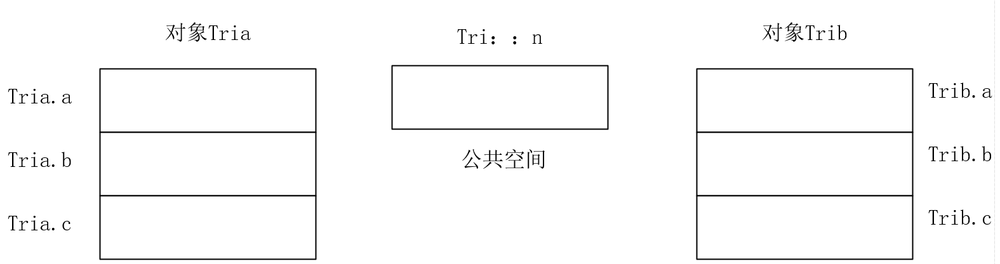
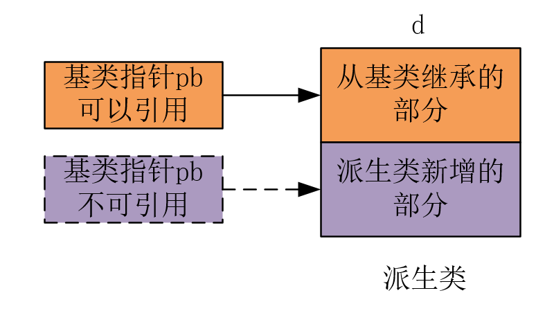

[TOC]
## 1.封装
## 2.继承
## 3.多态
多态性是指相同的操作或函数、过程可作用于多种类型的对象上并获得不同的结果。
<font color=red>不同的对象，收到同一消息可以产生不同的结果</font>，例如，同样的输出操作，三角形类的对象调用这一操作时输出的是：一般三角形；而等边三角形类的对象调用时输出的是：等边三角形；

## 4.类成员的三种属性
### 4.1 private成员：
private成员数据或者成员函数，<font color=blue>只能被**本类**中的**成员函数**访问；</font>
### 4.2 protectd成员：
protectd成员数据或者成员函数，<font color=blue>只能被**本类**或**本类派生类**中的**成员函数**访问；</font>
### 4.3 public成员：
public成员数据或者成员函数，<font color=blue>既可以被**本类**的成员函数访问，也可以被**类外的函数**访问</font>
### 4.4 总结:
1. 类的成员数据类型;
    
    * protected:protectd成员数据或者成员函数，<font color=blue>只能被**本类**或**本类派生类**中的**成员函数**访问；</font>
    * private:private成员数据或者成员函数，<font color=blue>只能被**本类**中的**成员函数**访问；</font>
    * public :public成员数据或者成员函数，<font color=blue>既可以被**本类**的成员函数访问，也可以被**类外的函数**访问</font>
 2. 类继承方式:
    * public 继承:基类的中的**公有成员**(成员:成员函数与成员数据)和**保护成员**,在派生类中的**访问权限不变**,仍然是公有成员和保护成员;私有成员,在继承类中访问权限是不可访问;
    * protected 继承:基类的中的公有成员(成员:成员函数与成员数据)和保护成员,在派生类中的访问权限变为**保护成员**;基类中公有成员和保护成员在**派生类内部**都是可以访问的;私有成员,在继承类中访问权限是不可访问;
    * private 继承: 基类的中的公有成员(成员:成员函数与成员数据)和保护成员,在派生类中的访问权限变为**私有成员**;私有成员,在继承类中访问权限是不可访问;
    * 由此可见,无论何种继承方式,基类的private成员,均是不可以访问;


|基类中的成员|在公有派生中的访问属性|在保护派生中的访问属性|在私有派生中的访问属性|
|---------|----------|----------|----------|
|私有成员|不可访问|不可访问|不可访问|
|保护成员|保护|保护|私有|
|公有成员|公有|保护|私有|
---

## 5.构造函数
构造函数：系统创建对象时自动调用！！即创建一个类对象时就会隐式调用此类对象的构造函数；
1. 如果定义类时没有为类提供任何构造函数，系统会为该类自动提供一个无参的函数体为空的构造函数，表示对成员数据不做任何处理。
2. 参数全部默认的构造函数只能有一个，即可以不提供参数而调用的构造函数只能有一个。例如：类中不能同时出现以下两个构造函数：
```cpp
Tri(double x=5,double y=5,double z=5);
Tri();//默认参数为0，所以两者会产生歧义；
```

@[TOC]
### 5.1. 拷贝构造函数
```cpp
#include <iostream>
#include <list>
#include <vector>
#include <random>
using namespace std;

class Construct{

public:
    Construct(){
        std::cout<<"构造函数:Construct()"<<std::endl;
    };
    Construct(int data):m_data(data){
        std::cout<<"构造函数:Construct(int &data)-->"<<m_data<<std::endl;
    }

    Construct(const Construct &cons):m_data(cons.m_data){
        std::cout<<"拷贝构造函数: Construct(const Construct &cons)-->"<<m_data<<std::endl;
    }

    Construct & operator=(const Construct & cons){
        m_data=cons.m_data;

        std::cout<<"重载赋值运算符=:Construct & operator=(const Construct & cons)"<<std::endl;
        return *this;
    }

    ~Construct(){
        std::cout<<"析构函数:~Construct()"<<endl;
    }
private:
    int m_data=0;

};

int main()
{
    Construct a(50);                //调用构造函数:Construct(int data);
    Construct b(a);                 //调用拷贝构造函数:Construct(const Construct &cons);

    Construct c=b;                  //调用拷贝构造函数:Construct(const Construct &cons)?原因如下:
                                    //!构造函数的目的是给对象进行内存空间的分配,而新对象c还未分配内存空间,此时调用b对其赋值,则会
                                    //! 调用拷贝构造函数,在分配空间的同时,进行拷贝数据;

    c=a;                            //调用Construct & operator=,因为c在前面已经进行初始化并分配存储空间了,此时是对一个存在的
                                    //对象进行赋值,会调用赋值重载函数;

    Construct *d=nullptr;           //!不会调用任何构造函数,因为d是一个指针,只是可以指向一个Construct对象;
    Construct *e=new Construct;     //!调用构造函数:Construct(int data);
    return 0;
}

//-----------------------------------------------------------------------------------
构造函数:Construct(int &data)-->50
拷贝构造函数: Construct(const Construct &cons)-->50
拷贝构造函数: Construct(const Construct &cons)-->50
重载赋值运算符=:Construct & operator=(const Construct & cons)
构造函数:Construct()
析构函数:~Construct()
析构函数:~Construct()
析构函数:~Construct()
```

复制构造函数是<font color =red>只在对象实例化</font>时才会被调用，也就是说，有新对象产生(分配存储空间),才会调用构造函数;

赋值运算符则在<font color =red>一个现存的对象</font>被赋予新的值时被调用，并且它有返回值。

上例中:
```cpp
	Construct a(50);               
    Construct b(a);                 
    Construct c=b;
```
`a,b,c`是新产生的对象,在此之前并没有`a,b,c`,此时需要调用构造函数分配内存空间与初始化;所以会调用构造函数,至于调用构造函数是默认构造函数`Construct(int &data)/Construct();`还是拷贝构造函数取决于传递的参数(重载);

```cpp
c=a;
```
而`c=a	`中,对象`c`是一个已经存在的对象,其内存空间已经分配,所以不会调用`拷贝构造函数`,而是采用赋值的方式进行赋值(重载`=`);

### 5.2.总结
所以并不是: 	`Construct b(a); `就调用`拷贝构造函数`,而`Construct c=b;`就调用`赋值运算符`;而是根据赋值对象的属性进行调用,如果是一个新对象,此时就必须调用构造函数(默认构造函数/拷贝构造函数)进行内存空间分配以及初始化;
对于已经存在的对象(已经分配了内存空间)则会执行`赋值运算`;

---
## 6. 析构函数
析构函数的调用顺序正好和构造函数相反，<font color=red>先构造的对象后析构，后构造的对象先析构。</font>

一般情况下不需要定义析构函数，仅当**若在构造函数中使用new运算符为对象中的成员数据动态分配了存储空间时**需要在析构函数中调用delete释放空间；

---

## 7. 构造对象的顺序
1. 全局对象在main函数执行前被构造；
2. **静态局部对象在其进入其作用域时被构造，且只构造一次，在程序结束后才被析构；**
3. 动态局部对象在其进入作用域时被构造，在其作用域结束后被析构；

---
## 8. 临时对象

```cpp
类名（参数列表）；
```
临时对象的生存周期很短，仅仅在引用其的表达式范围内有效，一旦程序执行完这个表达式，就会自动调用析构函数撤销该对象；

```cpp
#include<iostream>
using namespace std;
Class Tri
{
    ....
};
int main()
{
    Tri tria(3,4,5);
    Tri(5,5,5);             //调用构造函数建立临时对象，随后撤销临时对象；
    cout<<"main函数"<<endl;
    return 0;
}

```
---

## 9. const成员与对象
### 9.1 const成员数据
用const声明的成员数据，称为常成员数据，<font color=red>其值必须使用参数初始化列表的构造函数进行初始化，并且这个值在程序的运行过程中不能被改变</font>
### 9.2 const 成员函数
如果要求成员函数中的`所有成员数据`的值都不允许改变，则定义为const 成员函数；

---

## 10. 常对象
如果要求类的对象在程序运行过程中一直保持初始值，则可以定义为`常对象`，即：<font color=blue>常对象在定义时用构造函数赋初始值后，对象中所有的`数据成员`的值都不能被重新赋值；</font>

```cpp
const 类名 对象名(<参数>)；
```
### 10.1
1. 常对象除了由系统自动调用构造函数和析构函数外，<font color=blue>只能调用它所在类的`常成员函数`，而不能调用普通成员函数；</font>
2. 如果一定要修改常对象中某个数据成员的值，可以将该数据成员声明为`mutable`，即可变的数据成员，然后就可以进行修改了；

```cpp
#include <iostream>
using namespace std;

class Tri
{
 private:
    mutable int a; //可变数据成员
    int b, c;
 public:
    Tri ();
    double Peri(void )  const //常成员函数
    {
        ...
    }

    double Area(void )
    {
        ...
    }
...

};
int main()
{
    Tri const tria(3,4,5);
    Tri trib(5,5,5);
    cout<<tria.Peri()<<endl;//常对象只能调用常成员函数
    cout<<trib.Peri()<<endl;
    return 0；

}
```
---

## 11. 静态成员与友元函数
### 11.1 静态成员
如果将类的某一个成员数据的存储类型指定为`静态类型时`，这个成员数据就为各对象的所共有，在内存中只占用一份存储空间，他的值对于所有的对象都是一样的，所有对象都可以引用它，相当于类中的`“公用数据”`；
```cpp
class Tri
{
    private:
        double a,b,c;
    public:
        static int n;//公有静态成员数据。
        ...
}
```

1. 在类中，静态成员数据的空间是`公共的、唯一的，属于所有同类`对象。这个<font color=blue>公共空间可以用对象名引用，如tria.n,trib.n,也可以直接用类名引用Tri::n;</font>


1. 静态成员函数<font color=red>必须要在类体外</font>进行初始化说明，初始化的格式为：

数据类型 类名：：静态成员数据名=初值；

如若不赋初始值，系统默认为0；

3. 静态成员数据属于类，`被所有对象共享`，**定义了类以后，即使还没有创建对象，类的静态成员数据就已经存在，并且可以被访问。**


### 11.2友元函数
封装将类的"私有"成员与"保护"成员"屏蔽"起来,不允许**类外函数**访问,但是,有时候类外的成员函数需要访问这些被"屏蔽"的成员,为了解决此现象,可以通过一下两种方法解决:
1. 将私有成员访问权限==>重新定义为public;
    单数这样就会破坏这些数据的隐蔽性,从而导致任何函数都可以无约束的访问他们;
2. 采用友元函数;
   通过将一个普通函数声明成为一个友元函数,那么这个友元函数,就可以访问这些"私有"成员与"保护"成员";<font color>只有声明为友元函数的外部普通函数,才能访问类的保护和私有成员数据;</font>
友元函数的定义:
```cpp
class 类名:
{
    friend 函数类型 函数名 (<参数列表>);//在类体中声明该类的友元函数;
}

#include <iostream>
using namespace std;
class FriendFunc
{
  private:
  string a;

  protected:
  int b=0;
  public:
  FriendFunc(string str,int b_):a(str),b(b_){}

  void print_public(){
    cout<<"class function member output:"<<"a="<<a<<"b="<<b<<endl;
  }

  friend void print_frind(FriendFunc &data);//!通过友元函数访问私有成员与保护成员;
};
void print_frind(FriendFunc &data)
{
  cout<<"frind function output :"<<"a="<<data.a<<"b="<<data.b<<endl;//!通过友元函数访问私有成员与保护成员;
}
int main()
{
  FriendFunc data1("test",100);
  data1.print_public();//调用成员函数,访问私有变量
  print_frind(data1);  //友元函数,访问私有变量 
  return 0;
}
```
---

## 12. 静态成员函数

1. 静态成员函数是专门操作静态成员数据的成员函数，与具体的对象无关，<font color=red>没有this指针，只能直接引用静态成员数据。</font>
2. 静态成员函数`可以用对象名调用`，如tria.show();(show 为 静态成员函数)，`也可以直接用类名调用`，**如Tri::show();**
3. 静态成员函数属于类，**在定义了类以后，即使没有创建对象，类的静态成员函数也可被访问。**
4. **静态成员函数和静态成员一样,不属于类对象**,因此不含有this指针,也**无法调用非静态成员函数**;

---

## 13. 重载运算符
可以被重载的运算符：除了常用的运算符外下面运算符也可被重载：
* new delete new[] delete[];
不能被重载的运算符：
* ？：          (不支持三目运算符的重载)
* .             (成员运算符不能重载)
* .*            (成员指针运算符不能重载)
* ::            (作用域限定运算符不能重载)
* sizeof()      (字节个数运算符不能重载)

### 13.1 重载双目运算符为成员函数
重载运算符为成员函数时,运算符函数可以通过this指针直接操作对象的成员数据,这个this指针就是类的对象传递给运算符函数的隐含参数;
### 13.2 重载单目运算符为成员函数
单目运算符重载为成员函数时,就是操作数对象自身调用,**没有参数**;
### 13.3 重载双目运算符为友元函数
因为友元函数不是类的成员函数,所以友元函数中没有this指针,所有操作数都必须以参数的形式显示地列出来,由调用语句传递给函数;

```cpp
#include <iostream>
using namespace std;
class Tri
{
private:
  int real;
  int imaginary;

public:
  Tri(int x = 0, int y = 0) : real(x), imaginary(y) {}

  //!成员函数重载双目运算符(含有this指针):
  Tri operator+(Tri &tri)
  {
    Tri temp;
    temp.real = real + tri.real;                //==>temp.real=this->real+tri.real;
    temp.imaginary = imaginary + tri.imaginary; //==>temp.imaginary=this->imaginary+tri.imaginary;
    return temp;
  }

  //?友元函数重载双目运算符:(不含有this指针,所以需要传递两个类成员)
  friend Tri operator-(Tri &tri1, Tri &tri2);

  //!成员函数重载单目运算符(含有this指针):
  //为了区分前置++与后置++的重载运算符:
  //1.对于后置++,需要在参数列表中添加一个int;
  //2.前置++则不需要;
  Tri operator++(int) //后置++
  {
    this->real++;
    this->imaginary++;
    return *this;
  }
  //?友元函数重载单目运算符:(不含有this指针,所以需要传递类成员)
  friend Tri operator--(Tri &tri,int);//! 后置时,需要添加第二参数int

  int operator[](Tri &tri)//!重载[]必须要向()传递参数,所以可见[]可以是一个双目运算符,且只能作为成员函数进行重载;
  {
    return this->real+this->imaginary;
  }

 //!成员函数重载单目运算符(含有this指针):重载复合运算符,也可以为友元函数
  Tri operator+=(Tri &tri)
  {
      real+=tri.real;
      imaginary+=tri.imaginary;

      return *this;
  }

  friend Tri operator-=(Tri &tri,Tri &tri2);
  //?友元函数重载单目运算符:(不含有this指针,所以需要传递类成员)
  void print()
  {
    cout<<"The expression is :"<<real<<"+"<<imaginary<<"i"<<endl;
  }

  // Tri operator=(Tri &tri)  //!一般赋值运算符只能重载为成员函数;可以不用自定义,会默认定义一个;
  // {
  //     real=tri.real;
  //     imaginary=tri.imaginary;
  //     return *this;
  // }


  //!重载流插入与流提取,只能将其重载为对应的友元函数

  friend ostream& operator<<(ostream &out,Tri &tri);
  friend istream& operator>>(istream &in,Tri &tri);

};


Tri operator-(Tri &tri1, Tri &tri2)
{
  Tri temp;
  temp.real = tri1.real + tri2.real;
  temp.imaginary = tri1.imaginary + tri2.imaginary;
  return temp;
}
Tri operator--(Tri &tri,int)//!此处int只是用来表示后置操作;
{
  tri.real--;
  tri.imaginary--;
  return tri;
}
Tri operator-=(Tri &tri,Tri &tri2)
{
  tri.real-=tri2.real;
  tri.imaginary-=tri2.imaginary;
  return tri;
}


ostream& operator<<(ostream &out,Tri &tri)
{
  out<<"operator << overload :"<<tri.real<<"+"<<tri.imaginary<<"i"<<endl;
  return out;
}

istream& operator>>(istream &in,Tri &tri)
{
  cout<<"依次输入实部与虚部:"<<endl;
  in>>tri.real>>tri.imaginary;
  return in;
}
int main()
{
  Tri tri(3,4);
  Tri tri2(7,9),tri3;

  tri.print();
  tri2.print();

  tri++;
  tri.print();

  tri3=tri+tri2;
  tri3.print();

  tri--;
  tri.print();

  cout<<tri[tri2]<<endl;

  tri+=tri2;
  tri.print();

  tri-=tri2;
  tri.print();

  cout<<tri;
  cin>>tri;
  tri.print();

}
```
* 必须要要重载为成员函数的运算符:[],=;
* 必须要重载为成员函数的运算符:<< 与 >>;


---

## 14. 继承
### 14.1 单继承
```cpp
class <派生类>：【继承方式】<基类名>
{
    <派生类新增成员和成员函数的定义>；
}
```
```cpp
...
class A
{
private:
    double a,b,c;
public:
    Tri();
    double Area();
};

class B:public A
{
    ...
};
```
## 14.2 多继承
```cpp
class <派生类>：【继承方式1】<基类名1>，【继承方式2】<基类名2>，...，【继承方式 n】<基类名 n>
{
    <派生类新增成员和成员函数的定义>；
}
```
```cpp
class A
{
private:
    double a,b,c;
public:
    Tri();
    double Area();
};
class B
{
private:
    double a,b,c;
public:
    Tri();
    double Area();
};

class C:public A,public B
{
    ...
};
```
继承方式：
1. public
2. private
3. protected
## 14.3 派生类的构造函数和析构函数

### 14.3.1 单继承构造函数
在创建派生类的对象时，不仅要给派生类中的`数据成员`初始化，还要给从基类中继承过来的`数据成员`初始化！
派生类构造函数名（<font color=blue>总参数列表</font>）:基类构造函数名（<font color=blue>参数列表</font>）
{
    派生类中新增的成员初始化语句；
}

### 14.3.2 多继承构造函数

多继承创建构造函数时，调用基类构造函数的顺序**按照他们继承时说明的顺序，而不是派生类中构造函数的列举顺序**。
派生类构造函数名（<font color=blue>总参数列表</font>）:基类1构造函数名（<font color=blue>参数列表1</font>），基类2构造函数名（<font color=blue>参数列表2</font>），...，基类n构造函数名（<font color=blue>参数列表n</font>）
{
    派生类中新增的成员初始化语句；
}
```cpp
#include<iostream>

using namespace std;
class Stu
{
private:
    int stu_id;
double score;
    public:
    Stu(int n,double sc):stu_id(n),score(sc)
    {
        ;
    }
    void showA()
    {
        cout<<"学生成绩"<<endl;
    }
};
class Emp
{
private:
    int sta_id;
    double salary;
public:
    Emp(int n,double sl):sta_id(n),salary(sl)
    {
        ;
    }
    void showB()
    {
        cout<<"职工类"<<endl;
    }
};
class Stu_Emp:public Emp,public Stu
{
   public:
   Stu_Emp(int n1,double sc,int n2 ,double sl):Stu(n1,sc),Emp(n2,sl)//一般按照总参列表中的顺序给基类构造函数赋值；

};
in main()
{
    ....；
}
```
### 14.3.3 有子对象的派生类的构造函数
在类的数据成员中，还可以包含基类或其他类的对象，称为**子对象**，即对象中的对象。子对象中的数据成员在创建时同样需要初始化。
派生类构造函数名（<font color=blue>总参数列表</font>）:基类构造函数名（<font color=blue>参数列表</font>）,子对象名（<font color=blue>参数列表</font>）
{
    派生类中新增的成员初始化语句；
}
```cpp
#include<iostream>
using namespace std；

class Base1
{
    int x;
public:
    Base1(int a):x(a){}
    ~Base1(){}
};
class Base2
{
    int y;
public:
    Base2(int b):y(b){}
    ~Base2(){}
};

class Derived:public Base1,public Base2
{
    Base1 b1;
    Base2 b2;
public:
Derived(int a,int b):Base1(a),Base2(b),b1(a-b),b2(a+b)
{
    ...;
}
~Derived(){}
};
int main()
{
    ...;
}
```
### 14.3.4 派生类构造函数调用顺序
1. 调用基类构造函数，调用顺序按照它们继承时说明的顺序；
2. 调用子对象类的构造函数体中的内容；
3. 执行派生类构造函数体中的内容；
   即先进行对基类构造函数的构造后，再对派生类中的子对象进行构造，最后才是派生类的数据成员进构造；

---
## 15.继承的冲突与支配

### 15.1 冲突
在多继承的情况下，可能造成对基类某个成员的访问出现了不唯一的情况（例如相同的函数）,通过类限定符进行区分：
即

**类名：：成员名；**
```cpp
#include<iostream>

using namespace std;
class Stu
{
private:
    int stu_id;
double score;
    public:
    Stu(int n,double sc):stu_id(n),score(sc)
    {
        ;
    }
    void show()  //相同成员函数
    {
        cout<<"学生成绩"<<endl;
    }
};
class Emp
{
private:
    int sta_id;
    double salary;
public:
    Emp(int n,double sl):sta_id(n),salary(sl)
    {
        ;
    }
    void show()     //相同成员函数
    {
        cout<<"职工类"<<endl;
    }
};
class Stu_Emp:public Emp,public Stu
{
   public:
   Stu_Emp(int n1,double sc,int n2 ,double sl):Stu(n1,sc),Emp(n2,sl)//一般按照总参列表中的顺序给基类构造函数赋值；

};
in main()
{
    Stu_Emp s(10001,98,2001,2000.0);
    s.Stu::show();  //调用学生类同名成员函数
    s.Emp::show();  //调用职工类同名成员函数
    ...
}

```
### 15.2 支配
**当派生类中的某一个成员函数与基类的某一个成员成员函数相同时，派生类中的成员函数具有支配作用**，即派生类中的成员函数优先执行。
```cpp
#include<iostream>

using namespace std;
class Stu
{
private:
    int stu_id;
double score;
    public:
    Stu(int n,double sc):stu_id(n),score(sc)
    {
        ;
    }
    void show()  
    {
        cout<<"学生成绩"<<endl;
    }
};
class Emp
{
private:
    int sta_id;
    double salary;
public:
    Emp(int n,double sl):sta_id(n),salary(sl)
    {
        ;
    }
    void show()    
    {
        cout<<"职工类"<<endl;
    }
};
class Stu_Emp:public Emp,public Stu
{
   public:
   Stu_Emp(int n1,double sc,int n2 ,double sl):Stu(n1,sc),Emp(n2,sl);//一般按照总参列表中的顺序给基类构造函数赋值；
   void show() //? 与基类成员函数同名，具有支配作用
   {
       ;
   }

};
in main()
{
    Stu_Emp s(10001,98,2001,2000.0);
    s.show();//Emp.show()
    ...
}
```

---

## 16.赋值兼容原则
赋值兼容原则指的是在**公有派生**的情况下，派生类对象和基类对象间赋值关系！
1. 派生类对象可以赋值给基类对象

派生类对象中从基类继承过来的那一部分成员数据可以为基类对象中对应的成员数值赋值。


2. 派生类对象可以初始化基类引用：<font color=blue>即派生类对象中从基类继承过来的那一部分成员可以有一个基类别名br;</font>
```cpp
derived d;
base &br=d;
```

1. 派生类对象地址可以赋值给基类指针:<font color=blue>即：只能用基类指针引用派生类对象从基类继承过来的那一部分成员</font>



---

## 17. 虚基类

**在多继承中为了防止同一个公共的基类在派生类中产生多个复制，不仅占用存储空间，而且可能造成多个备份中的数据不一样和模糊引用**

为了避免这种情况的发生，采用虚基类的方法，使得在继承间接公共基类时只保留一份成员数据的备份，在此，将公共基类A说明为虚基类，这样，无论该基类如何派生，在派生类中只能保留一份备份。

虚基类<font color=red>在派生时进行声明</font>，其声明形式为：
```cpp
class 派生类名：virtual 访问限定符 基类类名{...};
或
class 派生类名： 访问限定符 virtual 基类类名{...};
```
```cpp
class B:public virtual A
{
    //类B新增成员；
}
class C:public virtual A
{
    //类C新增成员；
}
```
**所以派生的类D**
```cpp
class D:public B,public C
{
     //类D新增成员；
}
```
---
## 18.虚函数
### 18.1 虚函数定义

多态：多态是指同一个函数名具有不同的实现；
虚函数的作用和功能：从赋值兼容原则中可以知道，派生类对象的地址可以赋值给基类指针，此时基类指针只能引用派生类对象中从基类继承过来的那一部分成员。
```cpp
#include<iostream>
using namespace std;
const double PI=3.1415926
class circle
{
    double r;
public:
    Circle(double radius):r(radius)
    {
        ;
    }
    double Peri()
    {
        return 2*r*PI;
    }
    double Area()
    {
        return PI*r*r;
    }
};
class Cylinder:public Circle
{
    double h;
public:
    Cylinder(double rad,double heigth):Circle(red),h(heigth){}
    double Area()
    {
        return Peri()*h;
    }
};

int main()
{
    Circle *pb;
    Circle cr(1);

    pb=&cr;         //A:基类指针指向基类对象
    cout<<pb->Area()<<endl;     //计算圆面积

    Cylinder cy(3,5);
    pb=&cy;         //B:基类指针指向派生类对象

    cout<<pb->Area()<<endl;     //调用的是基类的同名函数

    cout<<cy.Area()<<endl;      //调用派生类的同名函数，支配原则
}

```
如果希望基类指针在指向不同的对象时，能够做出不同的反应，例如，基类指针指向派生类的对象时，执行pb->Area()时，能调用派生类的新增同名函数Area()，输出圆柱体的侧面积。即不同对象做出不同反应的多态性。
若要实现这种多态性，必须在程序运行中对pb->Area()；语句重新定位。当指向基类对象时，语句定位到基类Area()的代码段；当指向派生类对象时，语句定位到派生类新增的Area()代码段，这一过程称为**<font color =blue>动态联编</font>**
为了实现**动态联编**，需要将为实现多态性而运行的函数Area()定义为**虚函数**；
虚函数是**基类的成员函数**，定义虚函数的格式如下：
```cpp
virtual 函数类型 函数名 (参数列表)
{
    函数体；
}

class Circle
{
    ...
    virtual double Area()       //!注意是将基类成员设置成虚函数
    {
        return PI*r*r;
    }
}
```
此时，在执行main函数中执行`pb=&cy;cout<<pb->Area()<<endl;`语句时，调用的是派生类新增的Area()函数，输出的是圆柱体的侧面积。
* 注意：
1. 派生类中的虚函数必须与基类中的虚函数具有相同的函数名、相同的参数列表，相同或相似的返回类型(返回类型相似是指派生类中虚函数的返回类型可以是基类虚函数返回类型的公有派生)
2. **派生类中与基类中虚函数同原型的成员函数，也一定是虚函数，在其定义中，关键字可以省略，即虚函数可以是被继承。**
3. 虚函数是实现动态联编的必要条件，但不是唯一条件。动态联编的实现需要满足三个条件：
    1. 类之间满足赋值兼容原则
    2. 要在基类中声明虚函数
    3. 通过基类指针或基类引用调用虚函数
4. 虚函数**必须**是类的非静态成员函数
5. 构造函数不能是虚函数，析构函数可以是虚函数
6. 虚函数的执行速度要稍慢一些。为了实现多态性，每一个派生类中均要保存相应虚函数的入口地址表，函数的调用机制也是间接实现的；
### 18.2虚函数调用
虚函数的多态性是通过**基类指针**或**基类引用**对派生类对象的调用来实现；
```cpp
#include<iostream>
#include<cmath>
using namespace std;
const double PI=3.1415926;
class Circle
{
protected:
    double r;
public:
    Circle(double rad)
    {
        r=rad;
    }
    double Peri()
    {
        return 2*PI*r;
    }
    virtual double Area()           //基类虚函数
    {
        return PI*r*r;
    }
};
class Cyclinder:public Circle
{
    double h;
public:
    Cyclinder(double rad,double heigth):Circle(rad)
    {
        h=heigth;
    }
    double Area()                   //从基类派生的同原型函数依然是虚函数
    {
        return Peri()*h;
    }
};
class Cone:public Circle
{
    double h;
public:
    Cone(double rad,double heigth):Circle(rad)
    {
        h=heigth;
    }
    double Area()                   //从基类派生的同原型函数依然是虚函数
    {
        return PI*r*sqrt(r*r+h*h);
    }
};
void fun(Circle *pb)
{
    cout<<pb->Area()<<endl;
}
int main()
{   
    Cyclinder cy(3,5);
    Cone cn(3,5);
    cout<<"圆柱体的侧面积是：";
    fun(&cy);
    cout<<"圆锥体的侧面积是：";
    fun(&cn);
    return 0;
}
```
所以在执行过程中，当基类指针指向派生类对象，并且用基类指针调用虚函数`pb->Area()`时，执行的是派生类中新定义的同名函数；

### 18.3 纯虚函数
有时候基类中将一成员函数定义为虚函数，并不是**基类**本身的要求，而是考虑到派生类的需要，在基类中预留一个函数名，**具体功能留给派生根据需要实现**。
例如在Circle类中，定义一个求体积的虚函数Volume，圆形没有体积，因此该函数在圆形类中**没有实现部分**。但是，圆形的派生类圆柱体和圆锥体都存在体积，在派生类中可以实现这个函数。这样，在fun函数中，就可以添加pb->volume函数来求派生类对象的体积，相当于在基类中预留了一个待实现的接口，**如果没有声明这个函数名字，在通用程序fun中就无法实现多态性。**

```cpp
声明纯虚函数的一般形式：
virtual 函数类型 函数名(参数列表)=0；
```
* 注意：
1. 纯虚函数没有函数体，只是一个声明语句，后面带有分号；
2. 最后“=0”表示该虚函数没有任何具体实现，只是一个形式，可以被派生类继承和改写；
*  <font color=red>拥有纯虚函数的基类不能定义其对象，但可以定义其指针或引用</font>
```cpp
#include<iostream>
#include<cmath>
using namespace std;
const double PI=3.1415926;
class Circle
{
protected:
    double r;
public:
    Circle(double rad)
    {
        r=rad;
    }
    double Peri()
    {
        return 2*PI*r;
    }
    virtual double Area()
    {
        return PI*r*r;
    }
    virtual double volume()=0;          //纯虚函数，预留接口，保证多态性
    
};
class Cyclinder:public Circle
{
    double h;
public:
    Cyclinder(double rad,double heigth):Circle(rad)
    {
        h=heigth;
    }
    double Area()
    {
        return Peri()*h;
    }
    virtual double volume()
    {
        return Circle::Area()*h;        //冲突与支配，否则会执行派生类中的Area()
    } 
};
class Cone:public Circle
{
    double h;
public:
    Cone(double rad,double heigth):Circle(rad)
    {
        h=heigth;
    }
    double Area()
    {
        return PI*r*sqrt(r*r+h*h);
    }
    virtual double volume()
    {
        return Circle::Area()*h/3;        //冲突与支配，否则会执行派生类中的Area()
    } 
};
void fun(Circle *pb)
{
    cout<<pb->Area()<< " "<<pb->volume()<<endl;
}
int main()
{   
    Cyclinder cy(3,5);
    Cone cn(3,5);
    cout<<"圆柱体的侧面积和体积是：";
    fun(&cy);
    cout<<"圆锥体的侧面积和体积是：";
    fun(&cn);
    return 0;
}
```
### 18.4 抽象类
<font color=blue>如果一个类中至少有一个纯虚函数，那么这个类称为抽象类。</font>
抽象类具有以下特点：
1. **抽象类中纯虚函数可能是在抽象类中定义的，也可能是从它的抽象基类中继承下来且重新定义的；**
2. **<font color=red>抽象类必须用作派生其他类的基类，而不能用于直接创建对象实例，但可定义抽象类的对象的指针或引用以实现运行时的多态性。</font>**
3. **抽象类不能运作函数参数类型，函数返回值类型或显示转换类型。**
4. **抽象类不可以用来创建对象，只能用来为派生类提供一个接口规范，派生类中必须重载抽象类中的纯虚函数，否则它仍将被看作是一个抽象类；**
---

## 19.文件的打开与关闭
### 19.1打开文件
文件的打开是读写文件前所做的准备工作，具体包含：
1. 使文件通道(即定义的文件流类的对象)与具体的磁盘上的指定文件建立关联；
2. 指定文件的打开方式，如文件是用于输出还是输入，文本文件还是二进制文件；

* 文件的打开方式有两种：
    1. 调用文件流类的构造函数，在定义文件对象时按指定方式打开有关文件，其格式如下：
    **类名 文件对象名 ("磁盘文件名"，打开方式)；**
    ```cpp
    ifstream infile("a1.dat",ios_base::binary); //即打开当前目录下一个二进制文件a1.dat用于向内存空间输入数据；
    ofstream outfile("b1.txt");//即打开当前目录下一个文本文件b1.txt用于存放内存空间输出数据；
    ```
    2. 调用文件流类的成员函数open,在定义文件流类的对象后按指定的方式打开具体文件，格式如下：
    **文件流对象名.open ("磁盘文件名"，打开方式)；**
    ```cpp
    ifstream infile;
    infile.open("a1.dat",ios_base::binary);
    ```
**当打开文件的操作成功，则文件流对象返回非零值，反之，打开文件的操作失败，文件流对象值为0；**
所以可以根据返回值来判断打开文件是否成功。
```cpp
ifstream infile;
infile.open("a1.dat",ios_base::binary);
if(!infile)
{
    cout<<"open error！"<<endl;
}   
```
文件的打开方式有很多种，如果省略打开方式，则**默认是以文本打开**；

|方式|说明|
|----|----|
|ios_base::in|以输入方式打开文件|
|ios_base::out|以输出方式打开文件，如果当前目录中有同名文件，则**清除该文件内容**|
|ios_base::app|以输出方式打开文件，如果当前目录中有同名文件,则**原文件内容保持不变，新输入的数据添加在原文件内容的末尾**|
|ios_base::ate|打开一个已有文件，打开后文件指针指向文件末尾|
|ios_base::binary|以二进制方式打开一个文件|
|ios_basse::trunc|致使现有文件被覆盖|
### 19.2 关闭文件
当打开一个文件进行读写后，应该显示的关闭文件；通过成员函数`close()`

**文件流对象名.close()**
```cpp
ifstream infile("a1.dat",ios_base::binary);
if(!infile)
{
    cout<<"open error!";
}
...
infile.close();//关闭文件
```

### 19.2 文件的读写
文件的读写有两种方式：
1. 用运算符“>>”与“<<”输入输出标准类型的数据；
   
```cpp
#include<fstream>
#include<iostream>
using namespace std;
int main()
{
    ifstream infile("/home/mrzhao/Documents/Vscode/Cpp/a1.txt");  //默认以文本方式打开
    if(!infile)
    {
        cout<<"open Error!"<<endl;
        return EXIT_FAILURE;
    }
    ofstream outfile("/home/mrzhao/Documents/Vscode/Cpp/b1.txt",ios_base::out);
    if(!outfile)
    {z
        cout<<"不能建立输出文件！"<<endl;
        return EXIT_FAILURE;
    }
    int a[10];
    double sum=0,aver;
    for(int i=0;i<10;i++)
    {
        infile>>a[i];
        sum+=a[i];
    }
    aver=sum/10;
    for(int j=0;j<10;j++)
    {
        outfile<<a[j]<<'\t';
    }
    outfile<<endl;
    outfile<<"sum="<<sum<<'\n'<<"aver="<<aver<<endl;

    infile.close(); //关闭输入文件
    outfile.close();    //关闭输出文件
}
    
```
2. 通过输出流的各种成员函数(`get(),getline(),put()`)
3. 判断程序是否读到输入文件的末尾有两种方法：
   1. 使用文件流的成员函数eof(),如，inflile.eof(),若文件结束，返回0；
   2. 判断输入表达式的返回值，如infile>>a[i]或infile.get(),若文件结束，返回0；
```cpp
#include<fstream>
#include<iostream>
using namespace std;
int main()
{
    ifstream infile("/home/mrzhao/Documents/Vscode/Cpp/a1.txt");  //默认以文本方式打开
    if(!infile)
    {
        cout<<"open Error!"<<endl;
        return EXIT_FAILURE;
    }
    ofstream outfile("/home/mrzhao/Documents/Vscode/Cpp/b1.txt",ios_base::out);
    if(!outfile)
    {
        cout<<"不能建立输出文件！"<<endl;
        return EXIT_FAILURE;
    }
    char str[10][100];
    int count,i=0;
    while (!infile.eof())
    {
        infile.getline(str[i],100);     //从infile流中读取一行长度为100，存入str[i]中
        cout<<str[i]<<endl;
    }
    
    infile.close(); //关闭输入文件
    outfile.close();    //关闭输出文件
}
    
```

---
## 20. 模板
### 20.1 函数模板
模板是c++支持参数多态性的工具。函数模板的一般定义如下：

**template<模板参数表>
函数类型 函数名(函数参数表)
{
    函数体；
}**

```cpp
template<class T>
void swapx(T &a,T&b)
{
    T temp=a;
    a=b;
    b=temp;
}

调用方式和普通函数的调用方式是相同的；
```
函数模板定义只是对函数的描述，并不是一个真正的函数，编译系统不为其产生任何执行代码，如果要使其发生作用，必须在程序中对函数模板实例化；即函数模板->模板函数
```cpp
#include<iostream>
using namespace std;
template<class T>
void swapx(T &a,T&b)
{
    T temp=a;
    a=b;
    b=temp;
}
int main()
{
    int a=3,b=4;
    double x=1.2,y=3.14;
    char c1='t',c2='w';
    swapx(a,b);
    cout<<"a="<<a<<"b="<<b<<endl;

    swapx(x,y);
    cout<<"x="<<x<<"y="<<y<<endl;

    swapx(c1,c2);
    cout<<"c1="<<c1<<"c2="<<c2<<endl;
    return 0;
}
```


### 20.2 类模板
类模板使用流程如下：
类模板---实例化--->模板类---实例化--->对象；
类模板的一般定义格式：
**template <模板参数表>
class<类名>
{
    //类体说明
}；
template<模板参数列表>
函数类型    类名<模板参数名表>::成员函数1(函数形参表)
{
    //成员函数1 定义体
}
template<模板参数列表>
函数类型    类名<模板参数名表>::成员函数2(函数形参表)
{
    //成员函数2 定义体
}
...
template<模板参数列表>
函数类型    类名<模板参数名表>::成员函数n(函数形参表)
{
    //成员函数n 定义体
}**
```cpp
#include<iostream>
using namespace std;
template <class T>
class Tri
{
private:
    T a,b,c;
public:
    Tri(T,T,T);
    Tri(Tri &);
    T Peri(void);    
};
template<class T>
Tri<T>::Tri(T x,T y,T z)
{
    a=x;
    b=y;
    c=z;
}
template<class T>
Tri<T>::Tri(Tri &t)
{
    a=t.a;
    b=t.b;
    c=t.c;
}
template<class T>
T Tri<T>::Peri()
{
    return a+b+c;
}
int main()
{
    Tri<int> tria(3,4,5);
    Tri<int> trib(tria);
    cout<<"trib的周长是："<<trib.Peri()<<endl;

    Tri<double> tric(7.5,6.5,8.0);
    cout<<"tric的周长是："<<tric.Peri()<<endl;
    return 0;
}
```
---
## 21.异常处理
异常处理机制，其基本的思想是将异常的检测与处理分离。如果在执行一个函数的过程中发生异常，可以不在本函数中处理这个异常，而是发送一个消息，传给上一级(调用它的函数)，它的上一级捕捉到这个消息后进行处理。如果上一级的函数还不能处理，就继续向上传送......如果到最高一级还无法处理，就调用abort()函数终止程序执行。这样做的好处是使底层的函数专门用于解决实际任务，而不必在考虑异常的处理任务，使得代码易与追踪和维护。

**在c++程序中，任何需要检测异常的语句(包括函数的调用)都必须在try语句块中执行，如果异常存在，则使用throw语句引发一个异常，异常必须由紧跟在try语句后面的catch语句来捕捉并处理。因此try与catch总是结合使用的。throw、try和catch语句的一般用法如下：**

```cpp
throw<异常表达式>；
try
{
    //try 语句块；
}
catch (类型1 参数1)
{
    //针对类型1的异常处理
}
catch (类型2 参数2)
{
    //针对类型2的异常处理
}
...
catch (类型n 参数n)
{
    //针对类型n的异常处理
}
```
其中，异常类型可以是**基本数据类型、构造数据类型和类类型**，类型名后可以带变量名（对象），这样就可以像函数的参数传递一样，将异常类型表达式的值传入；
* 注意：
  1. 程序以正常的顺序执行到try语句，然后执行try块内的语句；
  2. 如果执行期间没有执行到throw（没有引起异常）,跳过异常处理区的catch语句块，程序向下执行。
  3. 若程序执行期间引起异常，执行throw语句抛出异常，进入异常处理区，将throw抛出的异常类型表达式（对象）依次与catch中的类型匹配，进入与之匹配的catch复合语句，运行至复合语句结束，然后跳过后面的catch子句，继续执行异常处理区后面的语句；
  4. 如果未找到与异常类型表达式对象匹配的catch子句，则自动调用abort终止程序；
   
```cpp
#include <iostream>
#include <ctime>
using namespace std;
double quo(int a, int b)
{
    if (b == 0)
    {
        throw b; //除数为0时，抛出一个整型异常
    }
    else
        return (double)a / b;
}
int main()
{
    int a, b;
    cout << "Input a b:" << endl;
    cin >> a >> b;
    try
    {
        cout << a << "/" << b << "=" << quo(a, b) << endl;
    }
    catch (int)
    {
        cout << "除数不能为0,重新输入：" << endl;
        cout << "Input a b:" << endl;
        cin >> a >> b;
        quo(a, b);
    }
    return 0;
}
```

**抛出异常的throw语句<font color=blue>相当于return语句</font>，可以返回异常类型的表达式的值，将此值为catch语句的形参赋值，在catch子句中就可以使用这个值.**
* 注意：
1. 被检测的函数或语句必须放在try块中，否则不起作用
2. try块和catch块作为一个整体出现，catch块必须紧跟try块之后，不能单独使用，在二者之间也不能插入其他语句；
3. 一个try-catch结构只能有个try块，却可以有多个catch块，以便与不同的异常类型表达式匹配；
4. 如果用catch(...)形式的子句，则表示它可以捕捉到任何类型的异常信息，一般放在所有的catch之后。
   
[下一篇:数据结构](数据结构.html)