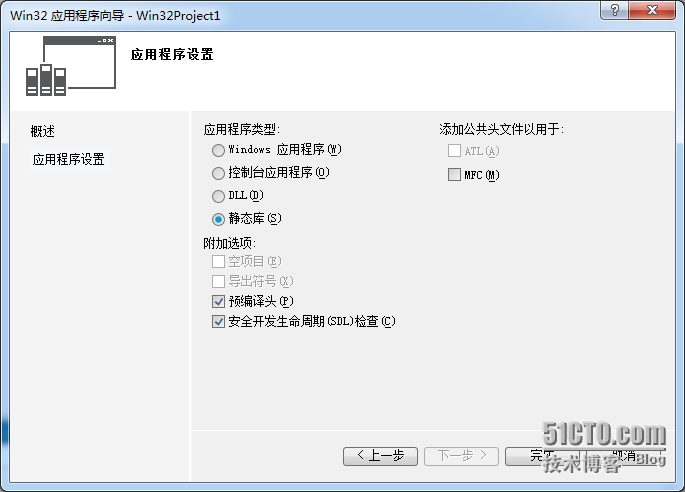

[TOC]

1.[基本语法](https://www.wiz.cn/feature-markdown.html)
# 1. 标题

在行首插入 1 到 6个#，分别表示标题 1 到标题 6

# 这是标题1
## 这是标题1
###### 这是标题6

点击保存后的效果：
标题1
标题2
标题6
# 2. 有序列表

在行首增加 1.、2.、3.，即数字和英文句点, 注意句点与文字中间有空格。不要求数字一定要连续，可以都是1. 

1. 有序列表
1. 有序列表
4. 有序列表

# 3. 无序列表

在行首增加 * 或 - 与文字之间有空格

* 无序列表
* 无序列表

# 4. 插入图片

可直接粘贴图片，或将图片文件拖动到光标处。 也可以使用标准的Markdown语法，如：  

# 5. 插入链接

[描述](链接地址) ，例如：[为知笔记](http://www.wiz.cn)，注意要使用英文符号

# 6. 粗体、斜体、删除线

粗体：在文字前后添加 ** (注意符号与文字间不要有空格） 斜体：在文字前后添加 * 删除线：在文字前后添加 ~~

**粗体**
*斜体*
~~删除线~~

# 7. 引用

在文字前 添加 > 点击保存后的效果：

>如果你无法简洁的表达你的想法，那只说明你还不够了解它。 -- 阿尔伯特·爱因斯坦

# 8. 表格

| 为知笔记|更新 | 版本 |
|------------|-----------|--------|
| WizNote | Markdown| Latest |

# 9. 代码

在代码前后增加 三个反单引号：```

```cpp
int i = 0; i = 1; 
for (int i = 0; i < 100; i++)
{
      printf("hello markdown!\n");
}
```

如果需要指定语言， 在开头的``` 后紧跟具体语言，如: ```java

# 10. 目录

在任何你想要展示Markdown 笔记目录的地方，添加 [TOC] ， 在阅读模式下，标题1~6样式的内容会被提取出来作为目录，相当于大纲功能。 例如：

[TOC] 


# 11. Mathjax 公式

    可以创建行内公式，例如：$\Gamma(n) = (n-1)!\quad\forall n\in\mathbb N$
    或者块级公式，
    $$ x = \dfrac{-b \pm \sqrt{b^2 - 4ac}}{2a} $$

# 12. 流程图

```flow

st=>start: Start

e=>end: End

op1=>operation: My Operation

sub1=>subroutine: My Subroutine

cond=>condition: Yes or No?

io=>inputoutput: catch something...

st->op1->cond

cond(yes)->io->e

cond(no)->sub1(right)->op1

```

注意： 1) 关键词（start、end、operation、subroutine、condition和inputoutput）后的冒号后要紧跟一个空格。 2) 使用->来连接两个元素，对于condition类型，有yes和no两个分支，如示例中的cond(yes)和cond(no)。 更多关于流程图的语法说明：http://adrai.github.io/flowchart.js/
# 13. 时序图

```sequence

Alice->Bob: Hello Bob, how are you?

Note right of Bob: Bob thinks

Bob-->Alice: I am good thanks!

```

更多关于时序图的语法说明：http://bramp.github.io/js-sequence-diagrams/
# 14. 脚注

在要添加注释的词语后面增加 [^1] ,结尾加入[^1]：空格 注释内容

hello[^1]
[^1]: hi
点击保存后的效果： 脚注

# 15.图片
格式： ![图片说明<可也不写>]\(图片的地址)
* 
* 
* 
* 
* [](https://postimg.cc/pp2ZbKrn)
* 

