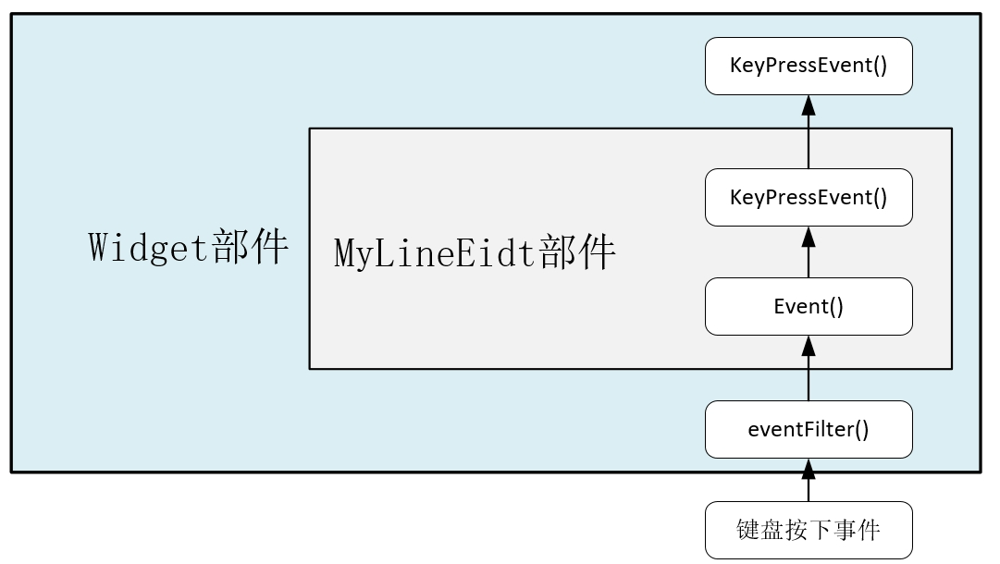

## 1.事件
### 1.1事件的传递

---
事件是先传递给指定窗口部件的，确切地说应该是先传递给获得焦点的窗口部件。<font color=blue>但是如果该部件忽略掉该事件，那么这个事件就会传递给这个部件的<font color=red>**父部件**</font></font>;
#### Example 1
0.创建一个widget部件，并对keyPressEvent()事件进行重载；

1.构建一个MyLineEdit类继承与QLineEdit类，并对keyPressEvent()事件进行重载；

2.在widget中添加MyLineEidt.

```cpp
//MyLineEidt.hpp
#ifndef MYLINEEIDT_H
#define MYLINEEIDT_H
#include <QLineEdit>

class MyLineEidt : public QLineEdit
{
public:
    explicit MyLineEidt(QWidget *parent=0);
protected:
    void keyPressEvent(QKeyEvent *) override;
};

#endif // MYLINEEIDT_H

#include "mylineeidt.h"
#include <QKeyEvent>
#include <QDebug>

//MyLineEidt.cpp
MyLineEidt::MyLineEidt(QWidget *parent):QLineEdit(parent)
{

}

void MyLineEidt::keyPressEvent(QKeyEvent *event)
{
    qDebug()<<tr("MyLineEidt键盘按下事件");
    QLineEdit::keyPressEvent(event);    //执行QLineEidt类的默认事件处理，否则编辑器无法编辑
    event->ignore();                    //忽略该事件，否则widget事件无法执行
}


//widget.hpp
#ifndef WIDGET_H
#define WIDGET_H
#include <QDebug>
#include <QWidget>
#include <QKeyEvent>

#include "mylineeidt.h"
QT_BEGIN_NAMESPACE
namespace Ui { class Widget; }
QT_END_NAMESPACE

class Widget : public QWidget
{
    Q_OBJECT

public:
    Widget(QWidget *parent = nullptr);
    ~Widget();

private:
    Ui::Widget *ui;
private:
    MyLineEidt *lineEidt=nullptr;
protected:
    void keyPressEvent(QKeyEvent *event);
};
#endif // WIDGET_H


//widget.cpp
#include "widget.h"
#include "ui_widget.h"
#include "mylineeidt.h"
Widget::Widget(QWidget *parent)

    : QWidget(parent)
    , ui(new Ui::Widget)
{
    ui->setupUi(this);
    lineEidt=new MyLineEidt(this);
    lineEidt->move(width()/2,height()/2);
}

Widget::~Widget()
{
    delete ui;
}

void Widget::keyPressEvent(QKeyEvent *event)
{
    qDebug()<<tr("widget按键按下事件");
}

```

---
### 1.2事件过滤器
1.在mylineedit.h中的public函数中声明：bool event(QEvent *event);
event()函数中使用了QEvent的type()函数来获取事件的类型，如果是键盘按下事件QEvent::KeyPress，则输出信息。<font color=blue>因为event()函数具有bool型的返回值，所以该函数的最后要使用return 语句，这里一般是返回父类的event()函数的操作结果。</font>
```cpp
bool MyLineEidt::event(QEvent *event) //事件
{
    if(event->type()==QEvent::KeyPress)//通过QEvent的type()函数来获取事件的类型；
    {
        qDebug()<<tr("MyLineEdit的event函数");
    }
    return QLineEdit::event(event);//执行QLineEdit类event()函数的默认操作
}
```

2.在widget.h进行public函数的声明：并需要在构造函数中最后一句添加：
```cpp
    lineEdit->installEventFilter(this); //在Widget上lineEdit安装事件过滤器
```
```cpp
bool eventFilter(QObject *obj,QEvent *event);
...
bool Widget::eventFilter(QObject *obj, QEvent *event)
{
    if(obj==lineEidt)   //如果是lineEidt部件上的事件
        if(event->type()==QEvent::KeyPress)
            qDebug()<<tr("Widget上的LineEidt的事件过滤器");
    return QWidget::eventFilter(obj,event);
}
```
在事件过滤器中，先判断该事件的对象是不是lineEidt，如果是，在判断事件的类型，最后返回了QWidget类的默认的事件过滤器的执行结果；
所以事件的传递顺序为：<font color=blue>先是**事件过滤器**->焦点部件的**event()函数**->焦点部件的**事件处理函数**；如果焦点部件忽略了该事件，那么会执行**父部件的事件处理函数**；</font>
[](https://postimg.cc/cvLFXDTb)

